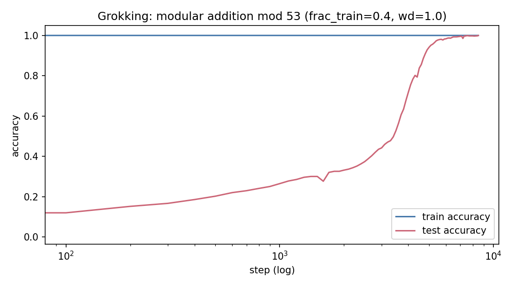

# Fourier-Circuit Reverse-Engineering of Grokking

Reproduction and mechanistic analysis of **grokking** (Power et al. 2022):
a one-layer transformer trained on (a + b) mod p memorizes its training
set early, sits at near-chance test accuracy for thousands of steps, then
abruptly generalizes — because it has internally constructed a discrete
Fourier transform (Nanda et al., ICLR 2023). This repo trains the model,
detects the transition, and reverse-engineers the learned algorithm with
falsifiable measurements.

## Verified results (run committed in `runs/full/`: p=53, frac_train=0.40, wd=1.0, seed 0)

| step | train acc | test acc | concentration | trig R^2 | excluded loss |
|---|---|---|---|---|---|
| 0     | 0.02 | 0.01 | 0.264 (~ flat null 0.226) | 0.00 | 3.98 (~ ln p) |
| 300   | 1.00 | 0.167 | —    | —    | —    |
| 500   | 1.00 | 0.203 | 0.34 | 0.04 | 0.084 (memorization floor) |
| 1000  | 1.00 | 0.265 | 0.39 | 0.11 | 0.25 |
| 2000  | 1.00 | 0.332 | 0.48 | 0.24 | 1.69  <- **t_signal** |
| 5000  | 1.00 | 0.941 | 0.82 | 0.75 | 13.3 |
| 8500  | 1.00 | **1.0000** | **0.943** | 0.74 | 16.7 |

* **Grokking reproduced** (P1): memorized by step ~300; test accuracy
  climbs slowly (0.12 at step 100 to 0.33 by step 2000), then rises
  sharply from ~step 3500, reaching 1.0000 by 8500; total weight
  norm falls 46 -> 31.7 through the transition.
* **The algorithm is Fourier** (P2, P4): embedding spectrum collapses onto
  key frequencies {1, 19, 9, 4, 23} — stable from step 1000 onward — with
  94.3% of embedding energy; the cos(w(a+b−c)) family explains ~3/4 of
  logit variance vs exactly 0.00 at init.
* **Progress measures lead the transition** (P3): excluded train loss
  lifts off its memorization floor at step 2000 — the memorization
  circuit is being replaced while train accuracy is still 100% — with
  test accuracy crossing 95% only at ~5100. Lead: t_signal = 0.39 * t_grok.




## Honest caveats
* `restricted_accuracy` as implemented (external least-squares trig fit)
  saturates to 1.0 within ~10 steps: the fit basis itself encodes the
  task, so any nonzero aligned component argmaxes correctly. It is kept
  as specified but is NOT discriminative; the informative measures are
  trig R^2, spectrum concentration, and excluded loss. The proper causal
  sufficiency test — ablating non-key frequencies in the *weights* — is
  extension M7 in CLAUDE.md.
* trig R^2 plateaus ~0.74-0.78 here because the run early-stops at
  concentration 0.943; the paper-scale config (p=113, frac 0.30, 40k
  steps: `examples/run_full.py --p 113 --frac 0.30`) continues weight-decay
  cleanup and is where the >0.9 acceptance criterion applies. CPU
  overnight or minutes on a free T4.
* t_grok and the key-frequency set are seed-dependent; claims above are
  for seed 0, exactly reproducible via the commands below.

## Reproduce
```bash
pip install -r requirements.txt
PYTHONPATH=. pytest tests/ -q                     # 15 passed (all CPU)
PYTHONPATH=. python examples/run_full.py          # groks in ~15 min CPU
PYTHONPATH=. python -m grok.analysis runs/full    # six measures per ckpt
PYTHONPATH=. python plots/make_plots.py runs/full # P1-P4
```
Training is resumable (`state_last.pt`); re-running the same command
continues an interrupted run.

## The mathematics (summary; full derivations in CLAUDE.md §2)
Orthonormal Fourier basis over Z_p: constant + normalized cos/sin pairs
at frequencies k = 1..p//2 (orthogonality via geometric sums of roots of
unity — tested to 1e-8). Learned algorithm: embeddings become trig lookup
tables at sparse key frequencies; attention+MLP compose sum-of-angle
identities to produce cos(w(a+b)); unembedding forms
logit(c) ~ sum_k a_k cos(w_k(a+b−c)), which constructive interference
maximizes exactly at c = (a+b) mod p (tested exactly on synthetic logits,
F6). Every measurement function is validated against synthetic
constructions BEFORE any training run (tests F2, F4, F5), so measurement
bugs cannot masquerade as results.

## Repository
    grok/{data,model,fourier,train,analysis}.py   tests/ (15, all CPU)
    examples/{run_smoke,run_full}.py   plots/make_plots.py
    runs/full/  committed artifacts: metrics.csv, metrics.json, P1-P4
    CLAUDE.md   full spec: math, tests, milestones, 52-question bank
