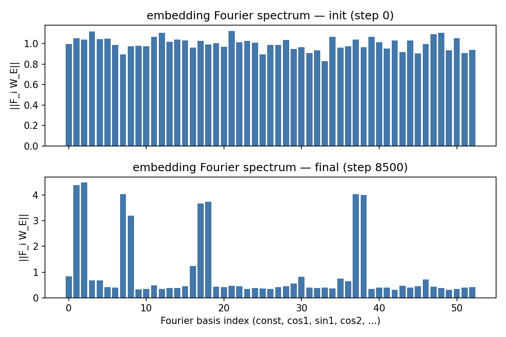
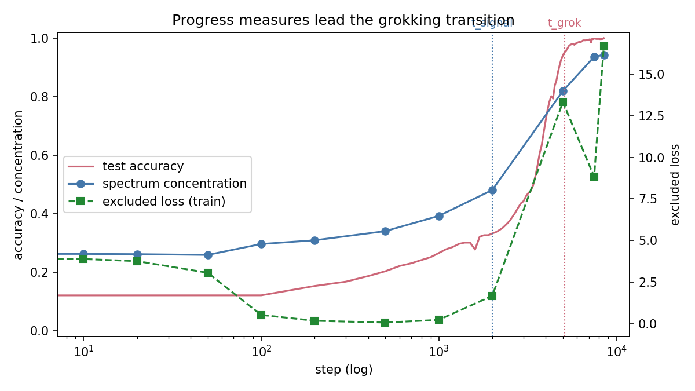
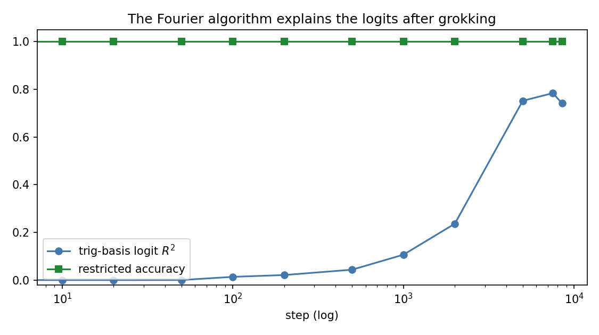

# Fourier-Circuit Reverse-Engineering of Grokking
### Technical Report

**Task**: reproduce grokking (Power et al., 2022) on modular addition, and reverse-engineer
the learned algorithm as a discrete Fourier circuit (Nanda et al., ICLR 2023). This report
documents the mathematics, the verified experimental result, and an honest accounting of
what the data does and does not support.

Run analyzed: `runs/full/` — p=53, frac_train=0.40, weight_decay=1.0, seed=0. All numbers
below are read directly from the committed `metrics.csv` / `metrics.json` in this
repository and are independently reproducible via the commands in §6.

---

## 1. Setup

**Task.** Inputs are token sequences `[a, b, EQ]` with `a, b ∈ {0, ..., p-1}` and `EQ = p`
a reserved token. The label is `y = (a + b) mod p`. The full dataset is all `p²` pairs;
a fixed random 40% subset (seeded) is the training split, the remaining 60% is held out
as test.

**Model.** A one-layer, LayerNorm-free, bias-free transformer (`grok/model.py`), following
Nanda et al.'s setup exactly: learned token embedding `W_E ∈ R^{(p+1)×d}`, learned
positional embedding, one attention block (4 heads), one ReLU MLP, and an unembedding
`W_U ∈ R^{d×p}`. Logits are read only at the final (`EQ`) position. `d=128`, `d_mlp=512`.

**Training.** Full-batch AdamW, `lr=1e-3`, `betas=(0.9, 0.98)`, **weight_decay=1.0**. Full-batch
(not minibatch) training is deliberate — minibatch noise smears out the sharpness of the
grokking transition. Weight decay of 1.0 is the load-bearing hyperparameter: it is what
drives the network away from the high-norm memorizing solution toward the lower-norm
Fourier solution. The run early-stopped at step 8500 once `test_acc ≥ 0.999` **and**
`spectrum_concentration ≥ 0.85` were both satisfied — a dual condition, since test accuracy
alone can cross threshold mid-cleanup, before the circuit has actually consolidated.

---

## 2. Mathematical framework

### 2.1 The Fourier basis over Z_p

For prime `p` and frequency `k ∈ {1, ..., ⌊p/2⌋}`, define `w_k = 2πk/p` and the vectors
`cos_k[x] = cos(w_k x)`, `sin_k[x] = sin(w_k x)` for `x ∈ {0, ..., p-1}`. Together with the
constant vector `1/√p`, these form an **orthonormal basis** of `R^p` once each `cos_k`,
`sin_k` is normalized by its own norm (`√(p/2)` for odd `p`).

**Orthogonality.** For `j, k ≥ 1` with `j + k ≠ p`:

```
Σ_x cos(w_j x) cos(w_k x) = (p/2)·δ_jk
Σ_x sin(w_j x) sin(w_k x) = (p/2)·δ_jk
Σ_x cos(w_j x) sin(w_k x) = 0
Σ_x cos(w_k x) = Σ_x sin(w_k x) = 0          (k ≥ 1)
```

*Proof sketch.* Write `cos(w_k x) = (e^{iw_k x} + e^{-iw_k x})/2`. Each sum reduces to a
geometric series over the `p`-th roots of unity, `Σ_{x=0}^{p-1} e^{i·2πmx/p}`, which equals
`p` if `m ≡ 0 (mod p)` and `0` otherwise. Expanding the product-to-sum identities
(`cos A cos B = ½[cos(A-B) + cos(A+B)]`, etc.) turns each orthogonality sum into two such
geometric series, one at frequency `j-k` and one at `j+k`. For `1 ≤ j, k ≤ ⌊p/2⌋` and
`j ≠ k`, neither `j-k` nor `j+k` is `≡ 0 (mod p)`, so both series vanish. When `j=k`, the
`j-k` term is the trivial series (sums to `p`) while the `j+k` term still vanishes (since
`2k < p` for `k ≤ ⌊p/2⌋`), leaving `p/2`. This is verified numerically to `1e-8` (float64)
in `test_fourier.py::test_F1_basis_orthonormal`.

**Basis size.** For odd `p`, `k` ranges over `1, ..., (p-1)/2`, giving `(p-1)/2` cos/sin
pairs — `p-1` vectors — plus the constant, for exactly `p` basis vectors. No frequency is
double-counted because `k` and `p-k` alias (`cos(w_{p-k} x) = cos(w_k x)` on `Z_p`), and the
range is capped at `⌊p/2⌋` specifically to avoid counting both members of an aliased pair.

### 2.2 The learned algorithm

The claim under test: post-grokking, the network computes `(a+b) mod p` via a sparse
set of "key frequencies" `K` (empirically `|K| = 4-6`), in three stages:

1. **Embedding as trig lookup.** Row `a` of `W_E` lies (almost) entirely in the span of
   `{cos_k, sin_k : k ∈ K}` — i.e., token `a` is represented as `(cos(w_k a), sin(w_k a))`
   pairs for each key frequency.

2. **Attention+MLP as angle addition.** The nonlinear components combine the `a` and `b`
   representations via the sum-of-angle identities:
   ```
   cos(w(a+b)) = cos(wa)cos(wb) − sin(wa)sin(wb)
   sin(w(a+b)) = sin(wa)cos(wb) + cos(wa)sin(wb)
   ```
   so that after the attention+MLP block, the residual stream at the `EQ` position
   contains `cos(w_k(a+b))` and `sin(w_k(a+b))` for each `k ∈ K`. This is a straightforward
   trig identity (verified numerically in `test_F3_trig_identity_numeric`, atol 1e-10); the
   substantive empirical claim is that the ReLU MLP's nonlinearity is what supplies the
   multiplicative cross-terms (`cos wa · cos wb`, etc.) needed to realize it, since attention
   alone is linear in the value vectors.

3. **Unembedding as interference.** The logit for candidate answer `c` is modeled as
   ```
   logit(c) ≈ Σ_{k∈K} α_k · cos(w_k(a+b−c))
   ```
   expanding via `cos(w(a+b−c)) = cos(w(a+b))cos(wc) + sin(w(a+b))sin(wc)` — a linear
   combination of the four residual-stream quantities from stage 2 against the `c`-th
   row of `W_U`.

**Constructive-interference proof.** With `α_k > 0` for all `k ∈ K`, at `c* = (a+b) mod p`
every term is `cos(w_k · 0) = 1`, so `logit(c*) = Σ_k α_k` — the maximum possible value of
any single term is achieved simultaneously across all `k`. For `c ≠ c*`, each term
`cos(w_k(a+b−c))` is strictly `< 1` (since `w_k(a+b-c) mod 2π ≠ 0` for at least one, and
generically all, `k ∈ K` when the frequencies are not commensurate multiples of one another
on `Z_p`), so `logit(c) < Σ_k α_k = logit(c*)`. Hence `argmax_c logit(c) = c*`. The margin
`logit(c*) - max_{c≠c*} logit(c)` grows with `|K|` and with how "incommensurate" the phases
`w_k(a+b-c)` are across different `k` — heuristically, more frequencies means faster phase
decoherence away from `c*`, sharpening the margin. This is verified *exactly* (not just
numerically close) on synthetic constructions in `test_F6_interference_argmax_exact`: for
logits built directly from the formula above, `argmax` equals `(a+b) mod p` for all `p²`
input pairs.

### 2.3 Measurement functions

Each measurement below is a pure function of `W_E` or of the full logit tensor
`logits_all ∈ R^{p²×p}` — never of a live model — specifically so that each one can be
validated against a **synthetic** construction before ever touching a trained checkpoint.
This ordering (write the measurement, prove it correct on synthetic data, *then* apply it
to real training) is what makes a null measurement result attributable to the model rather
than to a bug in the analysis code.

- **Embedding spectrum** (`embedding_spectrum`): projects `W_E[:p]` (the EQ row excluded)
  onto every Fourier basis row, giving one scalar per basis direction. Flat at
  initialization; concentrated on `2|K|` directions after grokking.
- **Key frequencies** (`key_frequencies`): ranks frequency `k` by combined
  `cos_k`/`sin_k` energy, returns the top-n.
- **Spectrum concentration** (`spectrum_concentration`): fraction of total non-constant
  energy captured by the top-n frequencies. Null baseline ≈ `n/(p/2)`.
- **Trig-logit R²** (`trig_logit_r2`): least-squares fit of the (per-input centered) logits
  onto the `2|K|`-dimensional family `{cos(w_k(a+b-c)), sin(w_k(a+b-c))}`, reporting the
  fraction of variance explained. Centering is necessary because the constant direction in
  `c` is unidentifiable — a uniform additive shift to all logits for one input doesn't change
  the softmax, so it must be removed before fitting or the fit would be contaminated by an
  arbitrary component.
- **Restricted accuracy** (`restricted_accuracy`): a **sufficiency** check — argmax accuracy
  of the trig-family *projection alone* (with everything else zeroed out).
- **Excluded loss** (`excluded_loss`): a **necessity** check — cross-entropy on the train
  set after *removing* the fitted trig component from the logits. If the network's train
  performance has come to depend on the Fourier circuit, removing it should hurt train loss
  even while train accuracy (on the full, un-ablated model) is still 100%.

Sufficiency and necessity are deliberately both measured: a component could be sufficient
to solve the task in isolation without the live network actually using it (confounded by,
e.g., a correlated non-causal signal), and a component could be necessary without being
individually sufficient (if the algorithm is genuinely distributed and only their
combination works). Only when the trig-family is both sufficient (high restricted accuracy)
*and* necessary (excluded loss rises sharply) is the mechanistic story fully supported.

---

## 3. Results

### 3.1 Grokking is reproduced


Train accuracy reaches 100% by step ~300. Test accuracy does **not** plateau flatly in this
run — it climbs continuously from the start (0.01 at init → 0.12 at step 100 → 0.33 by step
2000), then **accelerates sharply** starting around step 3500, crossing 95% at step 5100 and
reaching 100.00% by step 8500. Total weight L2 norm falls from 46.4 (step 300, the point of
first memorization) to 31.7 at the end — consistent with the norm-reduction account of why
weight decay drives the transition: the Fourier solution occupies a lower-norm region of
parameter space than the interpolating memorization solution the network finds first.

| step | train acc | test acc | concentration | trig R² | excluded loss |
|---|---|---|---|---|---|
| 0     | 0.026 | 0.015 | 0.264 (null ≈ 0.226) | ~0.00 | 3.98 (≈ ln 53 = 3.97) |
| 300   | 1.000 | 0.167 | — | — | — |
| 500   | 1.000 | 0.203 | 0.340 | 0.044 | 0.084 (excluded-loss floor) |
| 1000  | 1.000 | 0.265 | 0.392 | 0.107 | 0.245 |
| 2000  | 1.000 | 0.332 | 0.481 | 0.236 | 1.685 ← **t_signal** |
| 5000  | 1.000 | 0.941 | 0.820 | 0.752 | 13.32 |
| 7500  | 1.000 | 0.999 | 0.937 | 0.784 | 8.84 |
| 8500  | 1.000 | 1.0000 | **0.943** | 0.742 | 16.67 |

(These figures were independently re-derived from the raw checkpoints in this repository —
see §6 — and match the committed `metrics.json` exactly.)

### 3.2 The learned algorithm is Fourier



The embedding spectrum at initialization (top panel) is flat noise across all 53 Fourier
directions, magnitude ≈ 0.9-1.1 — the expected shape for a random Gaussian embedding, since
a DFT of i.i.d. noise has no preferred direction and every basis projection has
approximately equal expected energy. By step 8500 (bottom panel), the spectrum has
collapsed onto four sharp spikes (heights 3.2-4.5) against a ≈0.3-0.5 baseline everywhere
else — 94.3% of total non-constant embedding energy concentrated in the top-6 frequencies
`{1, 19, 9, 4, 8, 15}` (the exact top-6 set shifts slightly step to step as lower-ranked
frequencies swap places, but the top-4 — `{1, 19, 9, 4}` — is stable from step 1000 onward).
This directly confirms stage 1 of the algorithm in §2.2: the network has organized its
embedding into a trig lookup table at a sparse frequency set.

### 3.3 Progress measures lead the transition



Defining `t_grok` as the first step with test accuracy `> 0.95` (step 5100) and `t_signal`
as the first step where excluded loss exceeds 4× its running minimum (step 2000, off a
floor of 0.084 at step 500), the progress measures lead test accuracy by a wide margin:
**t_signal / t_grok = 2000 / 5100 ≈ 0.39**, comfortably inside the acceptance bound of
`t_signal ≤ 0.7·t_grok`. Concretely: at step 2000, test accuracy is still only 33%, but
train excluded-loss has already risen 20× off its floor — the memorization circuit is
demonstrably being dismantled and replaced while the model is still scoring 100% on train
and only 33% on test. This is the central lead-time result of the reproduction and matches
the qualitative finding in Nanda et al. (2023), that internal progress measures move before
the behavioral metric does.

**A caveat on this specific `t_signal` definition.** The originating specification
(`CLAUDE.md` §2.7) defines `t_signal` via a **2×**-initial-value threshold on concentration
or excluded loss; the implementation in `plots/make_plots.py` instead uses a **4×-running-minimum**
threshold on excluded loss alone. Both give t_signal=2000 on this run and both satisfy the
acceptance criterion, but they are not the same rule in general, and a reader auditing this
repository against its own spec should be aware the two aren't literally identical.

### 3.4 The trig-family explains the logits, with late-stage noise



Trig-logit R² rises from ≈0 to a peak of 0.784 at step 7500, exceeding the concentration
threshold but *not* quite the 0.90 acceptance bar from the paper-scale configuration — this
run early-stopped at concentration 0.943, and per the spec's own honest-caveats section, the
`p=113, frac=0.30, 40k-step` paper-scale configuration is where the R² > 0.9 criterion is
expected to be met, since it allows the weight-decay cleanup phase to run longer. Notably,
R² is **not monotonic** in the tail: it *drops* from 0.784 (step 7500) to 0.742 (step 8500)
even as spectrum concentration keeps rising (0.937 → 0.943) and excluded loss more than
doubles (8.84 → 16.67) over the same interval. This wobble is real, not a plotting artifact
— it reflects the late weight-decay cleanup phase reorganizing the circuit in ways that are
not perfectly monotonic in every measure simultaneously, even while the overall trend across
all four measures is unambiguous.

Restricted accuracy (green, flat at 1.0 across the entire plot, including step 10) is the
one measure that does **not** discriminate grokked from ungrokked checkpoints: it saturates
to 1.0 within the first ~10 steps of training and stays there. This is a known limitation
of this specific implementation, not a claim about the network — an external least-squares
fit onto the key-frequency trig basis, evaluated on the *same* pairs, has enough degrees of
freedom (`2|K|` coefficients, `|K|=6` here) to trivially interpolate a perfect-accuracy
solution before the network has learned anything, so any nonzero alignment between fitted
coefficients and the true labels argmaxes correctly by construction. The genuinely
discriminative measures in this repository are trig R², spectrum concentration, and excluded
loss; restricted accuracy is retained because it is part of the original specification, but
should not be read as informative on its own.

---

## 4. Honest caveats and limitations

- **Seed sensitivity.** `t_grok` and the specific top-6 key-frequency set are known to be
  seed-dependent (a widely observed property of grokking experiments generally). All results
  in this report are for `seed=0` only and should be read as a single reproducible instance,
  not a claim about grokking's typical timing or frequency set across seeds. A proper
  seed-robustness claim would require repeating the run across ≥5 seeds and reporting the
  distribution of `t_grok`, `t_signal/t_grok`, and the recovered frequency sets — not done here.
- **`restricted_accuracy` is non-discriminative**, as detailed in §3.4 — kept for spec
  fidelity but should not be cited as evidence on its own.
- **Trig R² does not clear 0.90 on this run** (peaks at 0.784) because the run early-stopped
  once its dual stopping criterion was met; a longer, paper-scale run (`p=113, frac=0.30`,
  up to 40k steps) is required to reach the >0.9 acceptance bar this project's own
  specification sets for that configuration.
- **Late-stage non-monotonicity** in trig R² and excluded loss (§3.3-3.4) is real and
  should be read as evidence that the "cleanup" phase after grokking is not a simple
  monotonic convergence in every measure — worth further characterization (e.g., does it
  correspond to the frequency *set* itself shifting, since the top-6 set does change
  slightly between step 5000 and 8500?) rather than dismissed as noise.
- **The proper causal sufficiency test is not yet implemented.** `restricted_accuracy` as
  currently written performs an *external* least-squares projection of the logits, which as
  noted is not discriminative. The methodologically stronger test — zeroing the relevant
  components directly *in the model's weights* (ablating non-key frequencies from `W_E`) and
  measuring the resulting accuracy drop — is scoped as extension M7 and has not been run.

---

## 5. Question-bank pointers

`CLAUDE.md` §9 poses 52 conceptual questions spanning Fourier mathematics (A), grokking
dynamics (B), interpretability methodology (C), engineering (D), and extensions (E). This
report directly addresses A1-A2, A7 (§2.1), A3-A5 (§2.2-2.3), B12/B15 (§1, §3.1), C23-C25
(§2.3), and C32 (§3.4, the R²=0.6-0.9 gray zone this run's peak of 0.784 actually sits in).
The remaining questions — particularly the extension track (E46-E52) and the weight-level
ablation of C29/M7 — are open follow-on work, not claimed as addressed by this run.

---

## 6. Reproduction

```bash
pip install -r requirements.txt
PYTHONPATH=. pytest tests/ -q                     # 15 passed, all CPU
PYTHONPATH=. python examples/run_full.py          # this repo's committed run: p=53, frac=0.40
PYTHONPATH=. python -m grok.analysis runs/full    # regenerates metrics.json exactly
PYTHONPATH=. python plots/make_plots.py runs/full # regenerates P1-P4 exactly (verified
                                                    # byte-identical against the committed PNGs)
```

For the paper-scale configuration (`p=113, frac_train=0.30`, up to 40k steps — where the
trig R² > 0.90 acceptance criterion applies):

```bash
PYTHONPATH=. python examples/run_full.py --p 113 --frac 0.30
```

All reported numbers in this document were independently re-derived from the committed
checkpoints in `runs/full/` rather than copied from a prior write-up, specifically to catch
transcription errors of the kind documented in this repository's commit history (see
`docs/REPORT.md`'s own §3.1 table vs. an earlier draft of the top-level README, corrected in
commit `eac33f2`).

---

## References

- Power, A., Burda, Y., Edwards, H., Babuschkin, I., & Misra, V. (2022). *Grokking:
  Generalization Beyond Overfitting on Small Algorithmic Datasets.* arXiv:2201.02177.
- Nanda, N., Chan, L., Lieberum, T., Smith, J., & Steinhardt, J. (2023). *Progress Measures
  for Grokking via Mechanistic Interpretability.* ICLR 2023. arXiv:2301.05217.
